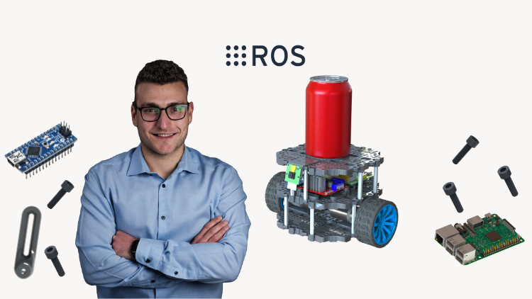

# Robotics and ROS - Learn by Doing! Manipulators
[![LinkedIn][linkedin-shield]][linkedin-url]
[![Udemy][udemy-shield]][udemy-url]
[![Skillshare][skillshare-shield]][skillshare-url]


<!-- PROJECT LOGO -->
<br />
<p align="center">
   
</p>


<!-- TABLE OF CONTENTS -->
## Table of Contents

* [About the Course](#about-the-course)
  * [Other Courses](#other-courses)
* [Getting Started](#getting-started)
  * [Prerequisites](#prerequisites)
* [Installation](#installation)
* [Usage](#usage)
* [Contributing](#contributing)
* [License](#license)
* [Contact](#contact)
* [Acknowledgements](#acknowledgements)


<!-- ABOUT THE COURSE -->
## About the Course
This repository contain the material used in the course **Robotics and ROS - Learn by Doing! Manipulators** that is currently available on the following platforms:

* [Udemy](https://www.udemy.com/course/robotics-and-ros-learn-by-doing-manipulators/?couponCode=LEARNBYDOING)
* [Skillshare](https://skl.sh/3UAFaXW)

In this course I'll guid you through the creation of a real robotic arm that you can control with your voice using the Amazon Alexa voice assistant.
Some of the concepts that are covered in this course are

* Gazebo Simulation
* Robot Kinematics
* ROS Basics
* MoveIt!
* Using Arduino with ROS
* Interface Alexa with ROS

Furthermore, all the laboratory classes in which we are going to develop the actual Software of our mobile robot are available both in **Pyhton** and in **C++** to let you the freedom of choosing the programming language you like the most or become proficient in both!


<!-- OTHER COURSES -->
### Other Courses
If you find this course interesting and you are passionate about robotics in general (not limited to manipulators), then you definitely have to take a look at my outher courses!

#### Self Driving and ROS - Learn by Doing! Odometry & Control
<br />
<p align="center">
   
</p>

If you are passionate about Self-Driving and you want to make a real robot Autonomously Navigate, then this course is for you! 
Apart from explaining in details all the functionalities and the logic of **ROS**, the Robot Operating System, it covers some key concepts of Autonomous Navigation such as

* Sensor Fusion
* Kalman Filter
* Probability Theory
* Robot Kinematics
* Odometry
* Robot Localization
* Control

Looks funny? Check it out on the following platforms:
* [Udemy](https://www.udemy.com/course/self-driving-and-ros-learn-by-doing-odometry-control/?couponCode=LEARNBYDOING)
* [Skillshare](https://skl.sh/3Jzo74f)


<!-- GETTING STARTED -->
## Getting Started
You can decide whether to build the real robot or just have fun with the simulated one. The course can be followed either way, most of the lessons and most of the code will work the same in the simulation as in the real robot

### Prerequisites
You don't need any prior knowledge of ROS nor of Robotics, I'll explain all the concepts as they came out and as they are needed to implement new functionalities to our robot.
A basic knowledge of programming, either using **C++** or **Python** is required as this is not a Programming course and so I'll not dwell too much on basic Programming concepts.

To prepare your PC you need:
* Install Ubuntu 20.04 on PC or in Virtual Machine
Download the ISO [Ubuntu 20.04](https://ubuntu.com/download/alternative-downloads) for your PC
* Install [ROS Noetic](http://wiki.ros.org/noetic/Installation/Ubuntu) on your Ubuntu 20.04
* Install ROS missing libraries. Some libraries that are used in this project are not in the standard ROS package. Install them with:
```sh
sudo apt-get update && sudo apt-get install -y \
     ros-noetic-rosserial \
     ros-noetic-gazebo-ros-control \
     ros-noetic-joint-state-publisher-gui \
     ros-noetic-rosserial-arduino \
     ros-noetic-moveit \
     ros-noetic-actionlib-tools
```
* Install VS Code and Arduino IDE on your PC in order to build and load the Arduino code on the device


### Installation

1. Clone the repo
```sh
git clone https://github.com/AntoBrandi/Robotics-and-ROS-Learn-by-Doing-Manipulators.git
```
2. Build the ROS workspace
```sh
cd ~/Robotics-and-ROS-Learn-by-Doing-Manipulators/Section9-Build_the_Real_Robot/arduinobot_ws
```
```sh
catkin_make
```
3. Source the project
```sh
source devel/setup.bash
```

<!-- USAGE EXAMPLES -->
## Usage

To launch the ROS **Simulated robot**
```sh
roslaunch arduinobot_bringup sim_complete.launch
```

To launch the **Real robot**, connect the Arduino to the PC and upload the code in the [folder](https://github.com/AntoBrandi/Robotics-and-ROS-Learn-by-Doing-Manipulators/tree/noetic/Section9-Build_the_Real_Robot/arduinobot_ws/src/arduinobot_controller/arduino/ros_robot_control) on the Arduino controller.
Then launch the real robot
```sh
roslaunch arduinobot_bringup complete.launch
```

To launch the interface with Alexa download [ngrok](https://ngrok.com/download) and create an [account](https://dashboard.ngrok.com/signup) then setup ngrok with your key
```sh
./ngrok authtoken <YOUR-KEY>
```
Then start the ngrok web server with
```sh
./ngrok http 5000
```
Copy the link that provides ngrok and paste it in the section Endpoint of your Alexa Developer account


<!-- CONTRIBUTING -->
## Contributing

Contributions are what make the open source community such an amazing place to be learn, inspire, and create. Any contributions you make are **greatly appreciated**.

1. Fork the Project
2. Create your Feature Branch (`git checkout -b feature/AmazingFeature`)
3. Commit your Changes (`git commit -m 'Add some AmazingFeature'`)
4. Push to the Branch (`git push origin feature/AmazingFeature`)
5. Open a Pull Request


<!-- LICENSE -->
## License

Distributed under the Apache 2.0 License. See `LICENSE` for more information.


<!-- CONTACT -->
## Contact

Antonio Brandi - [LinkedIn]([linkedin-url]) - antonio.brandi@outlook.it

My Projects: [https://github.com/AntoBrandi](https://github.com/AntoBrandi)


<!-- ACKNOWLEDGEMENTS -->
## Acknowledgements
* [Arduino 3D-Printed Robotic Arm](https://create.arduino.cc/projecthub/mircemk/arduino-3d-printed-robotic-arm-e824d8?ref=search&ref_id=robot%20arm&offset=86)
* [EEZYbotARM](https://www.thingiverse.com/thing:1015238)


<!-- MARKDOWN LINKS & IMAGES -->
[linkedin-shield]: https://img.shields.io/badge/-LinkedIn-black.svg?style=flat-square&logo=linkedin&colorB=555
[linkedin-url]: https://www.linkedin.com/in/antonio-brandi-512166bb/
[udemy-shield]: https://img.shields.io/badge/-Udemy-black.svg?style=flat-square&logo=udemy&colorB=555
[udemy-url]: https://www.udemy.com/user/antonio-brandi/
[skillshare-shield]: https://img.shields.io/badge/-Skillshare-black.svg?style=flat-square&logo=skillshare&colorB=555
[skillshare-url]: https://www.skillshare.com/en/profile/Antonio-Brandi/471799472
